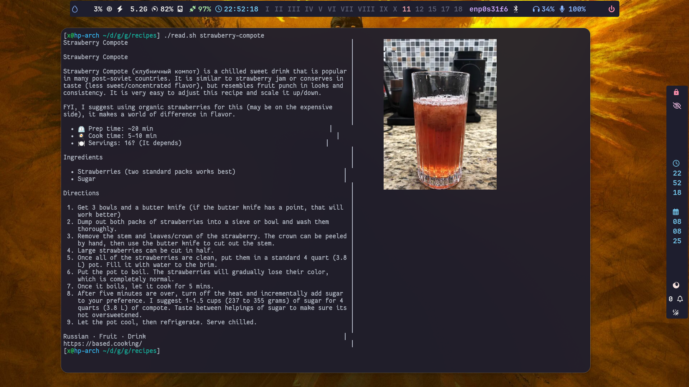
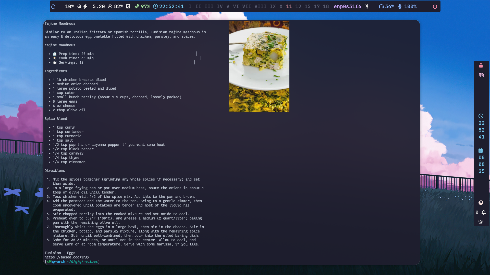

### curl (via tor(for extra anonymity)) to files based.cooking recipes and parse to markdown-like comfy format via w3m and read in terminal with images well rendered to the side.

###### u keep the original .html file, but while rendering recipe to terminal will parse each time :-)

 
use with the kitty terminal ^| u can use tmux in it

 
provided with 2 examples of already curled recipes

